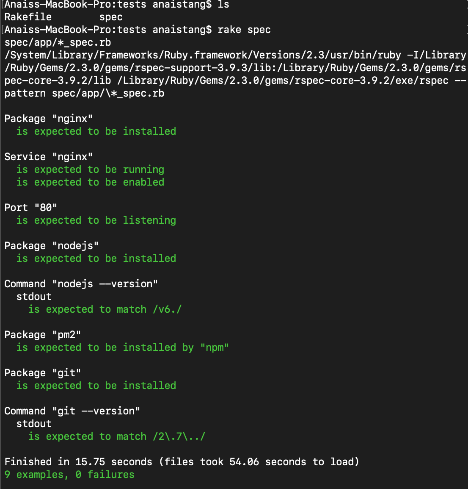
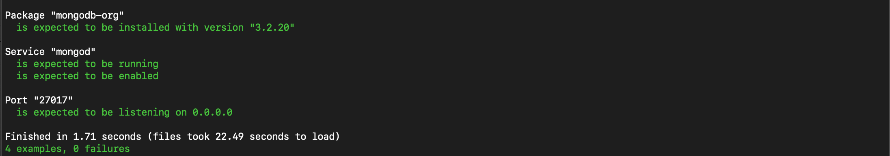

# Multi Vagrant VMs in One Vagrantfile

# The Base Config

Creating a second VM by providing them a unique hostname, IP address, and name setting to avoid conflicts.
```bash
# Install required plugins
required_plugins = ["vagrant-hostsupdater"]
required_plugins.each do |plugin|
    exec "vagrant plugin install #{plugin}" unless Vagrant.has_plugin? plugin
end

Vagrant.configure("2") do |config|
 # configuring the machine app 
 config.vm.define "app" do |app|
    app.vm.box = "ubuntu/xenial64"
    app.vm.network "private_network", ip: "192.168.10.100"
    app.hostsupdater.aliases = ["development.local"]
    app.vm.synced_folder "app", "/home/ubuntu/app"
    app.vm.provision "shell", path: "environment/app/provision.sh", privileged: false
  end

  config.vm.define "db" do |db|
    db.vm.box = "ubuntu/xenial64"
    db.vm.network "private_network", ip: "192.168.10.150"
    db.vm.provision "shell", path: "environment/app/provision.sh", privileged: false
  end
  
end
```

# Provisioning the db machine with a `MongoDB database`

```bash
└── multi-machine-demo
    └── environment
        └──  app
              ├── provision.sh
              └── ubuntu-xenial-16.04-cloudimg-console.log           
```

**provision.sh**

```bash
# Install mongodb
#Step 1:  Import the MongoDB public key
wget -qO - https://www.mongodb.org/static/pgp/server-3.2.asc | sudo apt-key add -

#Step 2: Generate a file with the MongoDB repository url
echo "deb http://repo.mongodb.org/apt/ubuntu xenial/mongodb-org/3.2 multiverse" | sudo tee /etc/apt/sources.list.d/mongodb-org-3.2.list

#Step 3: Refresh the local database with the packages
sudo apt-get update -y

#Step 4: Install the last stable MongoDB version and all the necessary packages on our system
sudo apt-get install -y mongodb-org=3.2.20 mongodb-org-server=3.2.20 mongodb-org-shell=3.2.20 mongodb-org-mongos=3.2.20 mongodb-org-tools=3.2.20

#Step 5: Getting MongoDB set up
sudo sed -i "s,\\(^[[:blank:]]*bindIp:\\) .*,\\1 0.0.0.0," /etc/mongod.conf
sudo systemctl start mongod
sudo systemctl status mongod
sudo systemctl enable mongod
```

# Running Tests
**First Test Pass**


**MongoDB Test Pass**
```bash
sudo systemctl enable mongodb
```


# Configuring and Connect MongoDB
Open mongo shell 

Open MongoDB shell on server 
```bash
mongo
```

Switch to the database admin
``bash
use admin
``

Create the root user
```bash
db.createUser({user:"admin", pwd:”password", roles:[{role:"root", db:"admin"}]})
```

Connect MongoDB
```bash
> mongo -u admin -p admin123 --authenticationDatabase admin
```

Checking the databases
```bash
> show dbs
```

---

